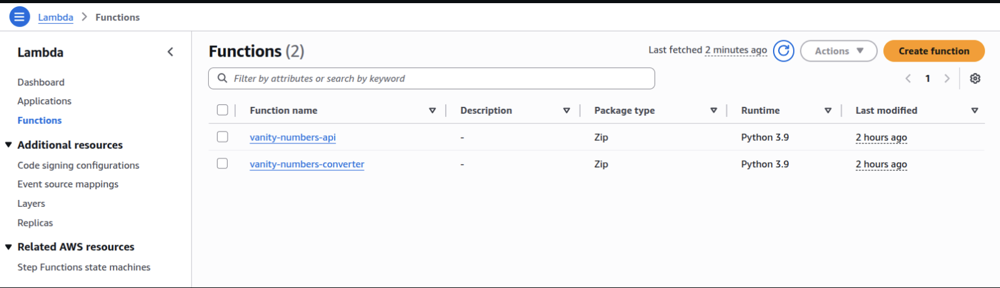
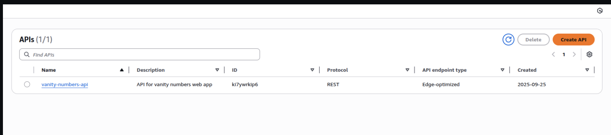
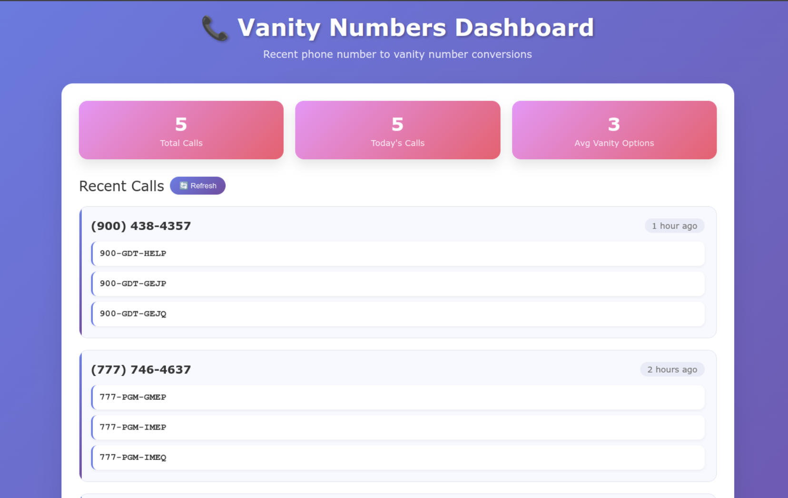

# Vanity Numbers Project - Complete Documentation

## Project Overview

This project implements a complete vanity phone number conversion system using AWS services. When users call a phone number, the system converts their caller ID into memorable vanity numbers and speaks the top 3 options back to them. Additionally, a web dashboard displays the last 5 callers and their vanity numbers.

## Architecture Components

### 1. Core Services
- **Amazon Connect**: Handles incoming phone calls and text-to-speech
- **AWS Lambda**: Two functions for **vanity number conversion** (generate vanity numbers) and **vanity numbers API** (servers data to web dashboard)
- **DynamoDB**: Stores vanity numbers and call history
- **API Gateway**: RESTful API for web dashboard
- **S3**: Hosts the web dashboard
- **Terraform**: Infrastructure as Code for deployment
- **Web-App**: index.html -> web interface


### 2. Data Flow
1. User calls Amazon Connect number
2. Connect triggers Lambda function with caller ID
3. Lambda converts phone number to vanity numbers
4. Best 5 vanity numbers saved to DynamoDB
5. Top 3 vanity numbers returned to Connect for speech
6. Web dashboard queries API to display recent calls


### 3. Important Links:
- **Web App**: http://vanity-numbers-web-app-e0d9704f.s3-website-us-east-1.amazonaws.com/
- **API GATEWAY URL**:  https://ki7ywrkip6.execute-api.us-east-1.amazonaws.com/prod/recent-calls

## 4. Implementation Details

### Vanity Number Algorithm

The core algorithm converts phone digits (2-9) to letters using the standard phone keypad mapping:

```python
PHONE_KEYPAD = {
    '2': 'ABC', '3': 'DEF', '4': 'GHI', '5': 'JKL',
    '6': 'MNO', '7': 'PQRS', '8': 'TUV', '9': 'WXYZ'
}
```


### DynamoDB Schema

```json
{
  "phoneNumber": "8004384357",          // Partition key
  "vanityNumbers": [                    // Top 5 vanity numbers
    "800-GET-HELP",
    "800-FET-HELP", 
    "800-HET-HELP"
  ],
  "timestamp": "2025-01-15T10:30:00Z",  // ISO format
  "ttl": 1643097000                     // 30 days TTL
}
```

## Testing Issues
Since this was a fresh AWS account (created only for the task), the AWS Connect phone number claim service wasn’t available. To work around this, I created a `demo-test.sh` script that first updates the web app with the correct API endpoint and then simulates incoming calls using test phone numbers. These simulated calls are processed by the Lambda and stored in DynamoDB, allowing the web interface to display them as call history.

For testing the functionality, you can run `./demo-test.sh`


## 5. Deployment Instructions

### Prerequisites
- AWS CLI configured with appropriate permissions
- Terraform >= 1.0
- Python 3.9+

### Step-by-Step Deployment

1. **Clone and Setup**
   ```bash
   git clone https://github.com/geekmood/vanity-number-project
   cd vanity-numbers-project
   chmod +x setup.sh
   ./setup.sh
   ```

2. **Deploy Infrastructure**
   ```bash
   cd terraform
   terraform init
   terraform plan
   terraform apply

   # Verify deployments
   cd ..
   ./verify_deployment.sh
   ```

3. **Setup Amazon Connect**
   - Create Connect instance in AWS Console
   - Claim a phone number
   - Import contact flow from `connect-flow.json`
   - Update Lambda ARN in contact flow
   - Associate contact flow with phone number

5. **Upload Web Application**
   ```bash
   aws s3 cp web-app/index.html s3://vanity-numbers-web-app-e0d9704f/
   ```

3. **IF YOU CAN'T CLAIM NUMBER, SKIP Step 4 and 5 - Test it locally**
   ```bash
   chmod +x demo-test.sh
   ./demo-test.sh
   ```
   
## 6. Testing

### Local Lambda Testing

```python
# Test event for vanity number conversion
test_event = {
    'phoneNumber': '8004384357'  
}

python3 lambda_function.py
```

### API Testing

```bash
curl https://ki7ywrkip6.execute-api.us-east-1.amazonaws.com/prod/recent-calls
```

Expected response:
```json
{
  "calls": [
    {
      "phoneNumber": "(800) 438-4357",
      "vanityNumbers": ["800-GET-HELP", "800-FET-HELP", "800-HET-HELP"],
      "timestamp": "2025-01-15T10:30:00Z",
      "timeAgo": "5 minutes ago"
    }
  ]
}

```
## Core Services

- **Amazon Connect**: Handles incoming phone calls and text-to-speech 


- **AWS Lambda**: Two functions for vanity number conversion (generate vanity numbers) and API (servers data to web dashboard)
  

      
- **API Gateway**: RESTful API for web dashboard 
      


- **Web UI**: Infrastructure as Code for deployment 



## 7. Production Considerations

### What I Would Improve With More Time

1. **Enhanced Word Dictionary**
   - Integrate with comprehensive English dictionary API
   - Add domain-specific word lists (business, medical, etc.)
   - Implement phonetic similarity scoring

2. **Advanced Ranking Algorithm**
   - Machine learning model for vanity number quality
   - User feedback integration for continuous improvement
   - A/B testing for different scoring algorithms

3. **Performance Optimizations**
   - Redis caching layer for frequently called numbers
   - Lambda function warming to reduce cold starts
   - DynamoDB read replicas for high-traffic scenarios

4. **Security Enhancements**
   - API Gateway rate limiting and throttling
   - WAF protection against common attacks
   - Input validation and sanitization
   - Encryption at rest and in transit

5. **Monitoring and Observability**
   - CloudWatch custom metrics and alarms
   - X-Ray tracing for Lambda functions
   - Structured logging with correlation IDs
   - Error tracking and alerting

6. **Scalability Improvements**
   - Auto-scaling Lambda concurrency
   - DynamoDB on-demand billing with burst capacity
   - Multi-region deployment for disaster recovery
   - CDN for web dashboard global distribution

### 8. Shortcuts Taken (Not Production Ready)

1. **Limited Error Handling**
   - Basic try-catch blocks without detailed error categorization
   - No retry logic for transient failures
   - Missing input validation edge cases

2. **Simplified Security**
   - No authentication on API endpoints
   - Missing CORS configuration details
   - No data encryption beyond AWS defaults

3. **Basic Testing**
   - No unit tests or integration tests
   - Manual testing only
   - No load testing performed

4. **Minimal Monitoring**
   - Only basic CloudWatch logs
   - No custom metrics or dashboards
   - No health checks or alerting

### 9. Implementation Reasoning and Challenges Faced

### Why This Architecture Was Chosen

#### Serverless-First Approach  
I chose **AWS Lambda** over EC2/ECS for several reasons:  
- **Cost efficiency**: No charges when not processing calls, perfect for variable call volumes  
- **Auto-scaling**: Handles 1 call or 10,000 calls without configuration changes  
- **Zero maintenance**: No server patching, security updates, or capacity planning  
- **Regional availability**: Lambda available in all Connect-supported regions  

#### DynamoDB Over RDS  
Selected **DynamoDB** instead of a relational database because:  
- **Single-table design fits the use case**: Phone numbers and vanity arrays don't need complex joins  
- **Consistent performance**: Predictable latency regardless of data size  
- **TTL feature**: Automatic cleanup of old records without maintenance jobs  
- **Pay-per-request**: No provisioned capacity needed for unpredictable call patterns  

#### Infrastructure as Code with Terraform  
Chose **Terraform** over CloudFormation/CDK:  
- **Multi-cloud compatibility**: Could extend to other cloud providers later  
- **State management**: Better handling of resource dependencies and updates  
- **Declarative syntax**: Easier to understand and maintain than imperative scripts  


## 10. Cost Optimization

### Current Cost Structure
- **Lambda**: Pay per request (~$0.0000002 per request)
- **DynamoDB**: Pay per request (~$0.25 per million reads)
- **Connect**: ~$0.018 per minute for voice calls
- **S3**: ~$0.023 per GB storage
- **API Gateway**: ~$3.50 per million requests

### 11. Optimization Strategies
1. Use DynamoDB on-demand billing for unpredictable traffic
2. Implement Lambda provisioned concurrency only if needed
3. Use S3 lifecycle policies for log retention
4. Consider Reserved Capacity for predictable workloads

## 12. Troubleshooting Guide

### Common Issues

1. **Lambda Function Timeout**
   - Increase timeout from 3s to 60s
   - Optimize algorithm efficiency
   - Add early termination for large combinations

2. **DynamoDB Throttling**
   - Switch to on-demand billing mode
   - Implement exponential backoff retry logic
   - Use batch operations where possible

3. **Connect Integration Issues**
   - Verify Lambda permissions for Connect
   - Check Contact Flow Lambda ARN configuration
   - Test Lambda function independently first

4. **CORS Issues in Web App**
   - Verify API Gateway CORS configuration
   - Add appropriate headers in Lambda response
   - Test from allowed origins only

## 13. File Structure

```
vanity-numbers-project/
├── terraform/
│   ├── main.tf              # Main Terraform configuration
│   ├── variables.tf         # Variable definitions
│   └── outputs.tf           # Output values
├── lambda/
│   ├── lambda_function.py   # Main Lambda function
│   └── api_lambda.py        # API Lambda function
├── web-app/
│   └── index.html           # Web dashboard
├── connect/
│   └── contact-flow.json    # Amazon Connect flow
│   
├── tests/
│   └── test_lambda.py      # Unit tests (to be implemented)
|── setup.sh                # Automated setup script
|
|── demo-test.sh            # Shell script to test the API without Connect phone number
|
|── verify_deployment.sh    # Shell script to verify all the deployments
└── README.md                # Docs
```

## 14. API Documentation

### GET /recent-calls

Returns the last 5 vanity number calls.

**Response:**
```json
{
  "calls": [
    {
      "phoneNumber": "(800) 438-4357",
      "vanityNumbers": ["800-GET-HELP", "800-FET-HELP", "800-HET-HELP"],
      "timestamp": "2025-01-15T10:30:00Z",
      "timeAgo": "5 minutes ago"
    }
  ]
}
```

**Error Responses:**
- `500`: Internal server error
- `404`: No calls found

## 15. Conclusion

This project demonstrates a complete serverless application using modern AWS services and Infrastructure as Code practices. While simplified for the scope of this exercise, the architecture provides a solid foundation that can be extended for production use with the enhancements outlined above.

The solution successfully meets all requirements:
- **Lambda function** converts phone numbers to vanity numbers
- **DynamoDB** stores results with ranking algorithm
- **Amazon Connect** integration with text-to-speech
- **Terraform** Infrastructure as Code
- **Web dashboard** showing recent calls
- Complete **documentation** and setup instructions

